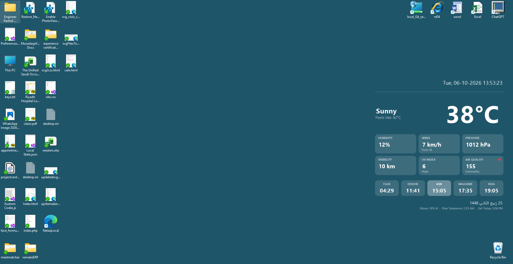

# Screen Image Manager

<!-- Add a screenshot of the generated image and of the settings window here:


-->

| About | Description  Status |
|------|--------------------|
| A small Windows desktop app (.NET Framework 4.8.1, WinForms) that creates a PNG image exactly the size of your primary screen, with your own text, a timestamp and a live weather panel on the right side. A settings window lets you configure everything, and a built-in scheduler button sets up a hidden Windows scheduled task that regenerates the image every few minutes. <br><br>Useful for desktop wallpapers (for example a wallpaper slideshow that points at the output folder), info screens, or any place that needs an always-fresh, screen-sized image. |  |


## Features

- **Exact screen size.** The image matches the real pixel resolution of the primary monitor, even when Windows display scaling (125%, 150%, ...) is on.
- **Custom look.** Background color, text, font, font size, margins and one master scale value that resizes everything.
- **Timestamp.** Any .NET date/time format, drawn in a smaller size below your text.
- **Weather panel.** Temperature, feels-like, condition, humidity, wind, pressure, visibility, UV index, air quality (color coded), prayer times (next prayer highlighted), Hijri date and moon information, all fetched from a configurable weather API.
- **Fails gracefully.** If there is no internet or the API fails, the image is still created, just without the weather panel.
- **Runs hidden on a schedule.** One button creates a Windows scheduled task that runs the app silently every N minutes. No console window, no UI.
- **Always the same output place.** Images are written to a sub folder next to the exe, and only the newest image is kept.

## Requirements

- Windows 10 or 11 (primary monitor is used)
- [.NET Framework 4.8.1](https://dotnet.microsoft.com/download/dotnet-framework/net481) (included with recent Windows 11 versions)
- To build from source: Visual Studio 2022 with the *.NET desktop development* workload and the .NET Framework 4.8.1 targeting pack

## How it works

The same executable has two modes:

| Start command | What happens |
|---|---|
| `ScreenImageManager.exe` | Opens the settings window |
| `ScreenImageManager.exe /run` | No window. Reads `settings.xml`, creates one image, writes a line to `run.log`, exits |

The scheduled task simply runs `ScreenImageManager.exe /run` at the interval you choose. Because every run reads `settings.xml` fresh, changing a setting takes effect on the next run with no reinstall. Only a changed interval needs the **Create / update task** button again.

Each run:

1. Reads the real pixel size of the primary screen.
2. **Deletes every file in the output sub folder.**
3. Calls the weather API (skipped if disabled, or if it fails).
4. Draws the image and saves it as `<unix-timestamp>_<file name>` (for example `1790834341_screen.png`).

> **Warning:** the output sub folder (default `Images`) is emptied on every run. Never point it at a folder that contains anything you want to keep. The app only accepts a plain folder name located inside the app folder, so it cannot be pointed at other locations.

## Getting started

### Install

1. Build the project in **Release** mode (or download a release build).
2. Copy `ScreenImageManager.exe` and `ScreenImageManager.exe.config` to a folder you can write to, for example `C:\Apps\ScreenImageManager`.
   Do not use `Program Files`: the app stores its settings, images and log next to the exe.
3. Start `ScreenImageManager.exe`.

### Configure and schedule

1. Adjust the settings on the tabs (see below) and click **Save**.
2. Click **Create image now** to test. The image is saved and Explorer opens on it.
3. On the **Schedule** tab, set **Run every (minutes)** and click **Create / update task**.

That's it. The task runs only while you are logged on (it needs access to the screen) and keeps running on battery power.

## Settings

| Tab | Setting | Notes |
|---|---|---|
| Output and Look | Output sub folder | Plain folder name inside the app folder, default `Images` |
| | Output file name | Prefixed with a Unix timestamp |
| | Background color | Hex such as `#1F5569`; text turns black or white automatically for contrast |
| | Text | Multi-line text shown on the right |
| | Font | Any installed font |
| | Font size | Fraction of the screen height |
| | Right margin | Fraction of the screen width |
| | Master scale | Scales all text and the weather panel (1.0 = normal) |
| Timestamp | Format | .NET format string, with a live preview (for example `ddd, dd-MM-yyyy HH:mm`) |
| | Size / gap | Relative to the main text |
| Weather | Show weather panel | Turn the whole panel on or off |
| | API URL, latitude, longitude, altitude | Sent to the API as query parameters |
| | Timeout | Seconds to wait before giving up |
| Units | Temperature, wind, pressure, visibility | Text shown after each value |
| Schedule | Run every (minutes) | 1 to 720 |

Settings are stored in `settings.xml` next to the exe and can also be edited by hand.

## Weather API

The app expects an HTTP GET endpoint that accepts `latitude`, `longitude` and `altitude` query parameters and returns JSON in this shape (values may be strings or numbers):

```json
{
  "temperature": "36",
  "feelsLike": "40",
  "condition": "Sunny",
  "conditionDescription": "Sunny",
  "humidity": "17",
  "pressure": "1013",
  "windSpeed": "10",
  "windFrom": "SE",
  "visibility": "10",
  "uvIndex": "4",
  "uvDescription": "Moderate",
  "airQualityIndex": "238",
  "fajar": "04:27",
  "dhuhr": "11:43",
  "asr": "15:08",
  "maghrib": "17:41",
  "isha": "19:11",
  "hijriDateString": "1448, 19 ,<month name>",
  "m": {
    "illumination": 83.47,
    "nmr": "Today 8:15 PM",
    "nms": "Tomorrow 10:38 AM"
  }
}
```

Missing fields show as a dash. Units are not part of the response, so set them on the **Units** tab to match your API. A response with neither `temperature` nor `condition` is treated as a failure. See below for how to set your own URL and location.

### Setting your own weather URL and location

The weather URL, latitude, longitude and altitude have default values in `AppSettings.cs`. **Before using the app, set these to your own values.** The comments in that file explain what to change. An API that is not compatible with the JSON format above will not work, so use your own compatible service if you need guaranteed availability.

There are two ways to change them:

- **In the app (recommended):** open the **Weather** tab, edit the values and click **Save**. They are stored in `settings.xml` next to the exe.
- **As new defaults for everyone who builds the project:** edit the defaults in `AppSettings.cs` and rebuild.

Keep in mind that values saved in `settings.xml` always win over the defaults in the code. If you change the defaults in `AppSettings.cs` and nothing seems to happen, delete `settings.xml` (or click **Reset to defaults** and **Save**) so the new defaults are picked up.

`settings.xml` contains your location, so do not commit it to a public repository. Keep it in `.gitignore`.

## Project structure

| File | Purpose |
|---|---|
| `Program.cs` | Entry point. Starts the settings window, or the silent `/run` mode |
| `Form1.cs` | Settings window (built in code, nothing to edit in the designer) |
| `AppSettings.cs` | Settings model and the XML load/save to `settings.xml` |
| `ImageCreator.cs` | Screen size detection, image drawing, weather API call |
| `TaskSchedulerHelper.cs` | Creates, queries and removes the scheduled task through `schtasks.exe` |

The code uses C# 7.3 (the .NET Framework default) and needs a reference to `System.Web.Extensions` (used for JSON parsing). There are no NuGet packages.

## Build from source

1. Open the solution in Visual Studio 2022.
2. Make sure the project targets **.NET Framework 4.8.1** and **Output type** is **Windows Application**.
3. Check that **References** contains `System.Web.Extensions`.
4. Build in **Release**. The output is in `bin\Release`.

## Troubleshooting

- **Weather panel missing.** Open `run.log` next to the exe. The line for the run says why, for example `Weather not available: ...`. The image is still created.
- **Task runs the wrong copy of the app.** The **Schedule** tab shows which exe the task points to. Open the app from the folder you want to use and click **Create / update task**.
- **Image does not update.** The task only runs while you are logged on. Check the task in Task Scheduler (`taskschd.msc`) under *Task Scheduler Library* and look at **Last Run Result**.
- **Debugger shows a `NonComVisibleBaseClass` warning** when clicking the arrows of a number box. This is a harmless Managed Debugging Assistant message that appears only inside Visual Studio. Click **Continue**, or untick it under *Debug > Windows > Exception Settings > Managed Debugging Assistants*.
- **Could not save settings.** The app folder is not writable. Install it somewhere like `C:\Apps\ScreenImageManager`.

## Limitations

- Windows only.
- Only the primary monitor is used.
- The scheduled task needs an interactive logon (it does not run when nobody is signed in).
- The weather panel depends on an external API.

## License

Free
